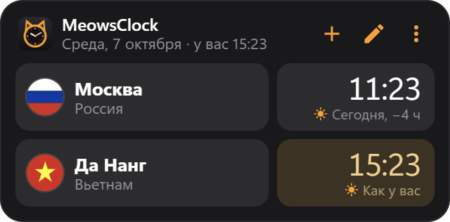

# MeowsClock

<p align="center"></p>

Виджет мирового времени для рабочего стола Windows 10/11 в стиле MeowsConvert.

- Показывает текущее время в выбранных городах: день/ночь, «Сегодня / Завтра / Вчера» и разницу с вашим временем.
  Города в вашем часовом поясе подсвечиваются.
- 128 городов: вся Россия по поясам, Вьетнам (Ханой, Да Нанг, Хошимин, Нячанг, Фукуок), СНГ, Азия, Европа,
  Америка. До 12 городов в виджете.
- `+` — поиск и добавление города (`↑` `↓` `Enter`, `Esc` — закрыть), карандаш — удалить города или перетащить их в другом порядке.
- Виджет встроен в рабочий стол: не перекрывает программы и не прячется при «Свернуть всё»
  (Win+D, жест тремя пальцами). Перетаскивается за шапку, правый клик — меню (секунды, поверх окон,
  прозрачность, стандартная ширина, автозапуск, скрыть).
- Ширину можно менять, потянув за левый или правый край (250–640 px). Двойной клик по краю возвращает стандартную ширину.
- Иконка в трее: вернуть скрытый виджет, автозапуск, выход.
- Место (и размер) виджета запоминаются относительно монитора: при подключении/отключении экрана, смене масштаба
  или разрешения виджет остаётся на своём мониторе, а не уезжает на соседний.

## Скачать

[Последний релиз](https://github.com/MrMe0ws/MeowsClock/releases/latest) — Windows 10/11 x64:

- `MeowsClock.Setup.X.Y.Z.exe` — установщик (ярлык на рабочем столе, удаление через «Приложения»);
- `MeowsClock-X.Y.Z-portable.zip` — без установки: распаковать и запустить `MeowsClock.exe`.

Файлы не подписаны, поэтому SmartScreen может предупредить о неизвестном издателе:
«Подробнее» → «Выполнить в любом случае».

## Запуск

```
npm install
npm start
```

## Сборка установщика

```
npm run dist
```

Установщик появится в `dist/`. Автозапуск лучше включать в установленной версии.
Настройки лежат в `%APPDATA%\MeowsClock\settings.json`.
